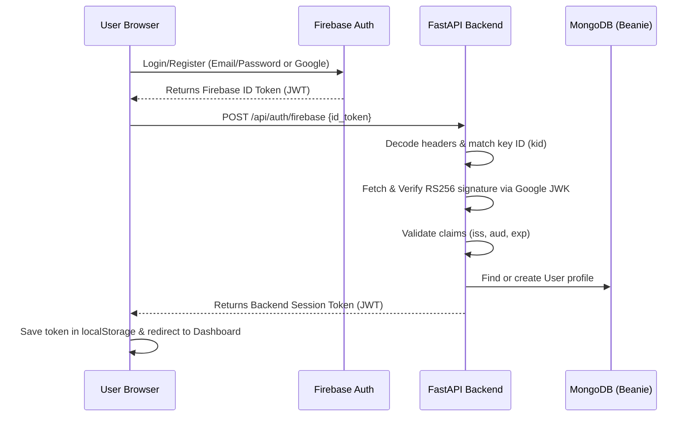

# Flint API — Thought Compression Engine Backend

FastAPI backend powering the [Thought Compression Engine](https://flintn.netlify.app) — an AI document intelligence platform that transforms PDFs into structured knowledge using Google Gemini.

**Frontend repo:** [Flint-UI](https://github.com/shammichalas/Flint-UI) · **Live demo:** [flintn.netlify.app](https://flintn.netlify.app)

---

## What it does

Upload a PDF and the backend:

1. Extracts and chunks text from the PDF
2. Generates Gemini embeddings for each chunk and stores them in MongoDB
3. Runs 4 parallel Gemini calls to produce a multi-level compression output — core insight, conceptual pillars, executive summary, and detailed analysis
4. Extracts concepts and builds a semantic relationship graph
5. Exposes endpoints for vector search, mental model generation (SWOT, First Principles, Decision Tree, Causal Loop), spaced repetition scheduling (SM-2 algorithm), scenario simulation, cross-document RAG synthesis, and an AI tutor chat

### Authentication Workflow

Flint implements a secure identity federation flow combining **Firebase Authentication** and standard **JWT Backend Sessions**:



1. **Client Auth**: The login page performs email/password signup/signin or Google Sign-In popups directly through the Firebase Web SDK.
2. **Token Exchange**: Upon successful login, the client fetches the Firebase ID Token and POSTs it to `/api/auth/firebase`.
3. **Backend Cryptographic Verification**: The backend verifier fetches Google's public JWK certificates (cached for 1 hour) to verify the token signature and claims.
4. **Session Handshake**: Once verified, the backend matches the email to a user profile in MongoDB (auto-creating one if new) and signs a custom backend JWT session token.
5. **Dashboard Access**: The frontend stores the backend JWT in `localStorage` to authorize standard API requests.

---

## Tech stack

| Layer | Technology |
|---|---|
| Framework | FastAPI + Uvicorn |
| Database | MongoDB (via Beanie ODM + Motor async driver) |
| AI | Google Gemini 2.5 Flash + Gemini Embedding 001 |
| Auth | JWT (python-jose) + bcrypt |
| PDF parsing | pypdf |
| Rate limiting | slowapi |
| Deployment | Render |

---

## API routes

All routes are prefixed with `/api`.

| Group | Prefix | Key endpoints |
|---|---|---|
| Auth | `/api/auth` | `POST /register`, `POST /login`, `GET /me` |
| Documents | `/api/documents` | `POST /upload`, `GET /`, `GET /{id}`, `DELETE /{id}`, `GET /search`, `GET /{id}/chunks`, `GET /{id}/mental-models`, `POST /{id}/mental-models`, `GET /{id}/quiz`, `POST /{id}/quiz/submit`, `GET /memory/stats` |
| Concepts | `/api/concepts` | `GET /`, `GET /{id}` |
| Intelligence | `/api/intelligence` | `POST /documents/{id}/simulate`, `GET /documents/{id}/simulations`, `POST /cross-reasoning`, `POST /tutor/chat`, `GET /dashboard/stats` |

Interactive API docs available at `/docs` when running locally.

---

## Local setup

### Prerequisites

- Python 3.11+
- MongoDB running locally (`mongodb://localhost:27017`) or a MongoDB Atlas connection string
- Google Gemini API key — get one free at [aistudio.google.com](https://aistudio.google.com)

### 1. Clone and install

```bash
git clone https://github.com/shammichalas/Flint-API.git
cd Flint-API
python -m venv venv
source venv/bin/activate        # Windows: venv\Scripts\activate
pip install -r requirements.txt
```

### 2. Set environment variables

Create a `.env` file in the project root:

```env
MONGODB_URL=mongodb://localhost:27017
DATABASE_NAME=thought_compression
SECRET_KEY=your-secret-key-min-32-chars
GEMINI_API_KEY=your-gemini-api-key
ALLOWED_ORIGINS=http://localhost:3000,https://flintn.netlify.app
```

> Generate a secure secret key with: `python -c "import secrets; print(secrets.token_hex(32))"`

### 3. Run the server

```bash
uvicorn app.main:app --reload --port 8000
```

API will be available at `http://localhost:8000`  
Swagger docs at `http://localhost:8000/docs`

---

## Project structure

```
Flint-API/
├── app/
│   ├── core/
│   │   ├── config.py          # Settings via pydantic-settings
│   │   ├── database.py        # Beanie + Motor init
│   │   ├── dependencies.py    # JWT auth dependency
│   │   ├── security.py        # Password hashing, token creation
│   │   └── rate_limiter.py    # slowapi limiter config
│   ├── models/                # Beanie document models
│   │   ├── user.py
│   │   ├── document.py
│   │   ├── chunk.py           # Embedding chunks
│   │   ├── concept.py         # Knowledge graph nodes
│   │   ├── mental_model.py
│   │   ├── memory.py          # SM-2 spaced repetition cards
│   │   └── simulation.py
│   ├── routers/
│   │   ├── auth.py
│   │   ├── documents.py       # Upload, search, quiz, mental models
│   │   ├── concepts.py
│   │   └── intelligence.py    # Tutor, simulation, cross-doc RAG
│   ├── schemas/
│   │   └── user.py
│   ├── services/
│   │   └── ingestion.py       # Core AI pipeline (chunking, embedding, Gemini)
│   └── main.py
└── requirements.txt
```

---

## Key features in depth

**Multi-level compression** — documents are compressed into 5 layers, from a single-sentence core insight up to a 600–800 word detailed analysis. Each layer is generated in parallel using `asyncio.gather`.

**Vector search** — chunks are embedded using `gemini-embedding-001` and stored in MongoDB. Search queries are embedded at runtime and ranked by cosine similarity computed in Python.

**Spaced repetition (SM-2)** — the quiz submit endpoint implements the SuperMemo SM-2 algorithm, adjusting ease factor and interval based on quiz score, and scheduling the next review date accordingly.

**Startup recovery** — on startup, any document stuck in `processing` or `pending` status (e.g. from a server restart mid-ingestion) is automatically re-queued via `asyncio.create_task`.

**Rate limiting** — all AI-heavy endpoints are rate limited via `slowapi` to prevent Gemini API quota exhaustion.

---

## Environment variables reference

| Variable | Required | Description |
|---|---|---|
| `MONGODB_URL` | Yes | MongoDB connection string |
| `DATABASE_NAME` | No | Database name (default: `thought_compression`) |
| `SECRET_KEY` | Yes | JWT signing key (min 32 chars, no default) |
| `GEMINI_API_KEY` | Yes | Google Gemini API key |
| `FIREBASE_PROJECT_ID` | Yes | Firebase project ID (for JWT token verification) |
| `ALLOWED_ORIGINS` | No | Comma-separated CORS origins |
| `ACCESS_TOKEN_EXPIRE_MINUTES` | No | Token lifetime in minutes (default: 1440) |

---

## Related

- [Flint-UI](https://github.com/shammichalas/Flint-UI) — Next.js 14 frontend
- [Live demo](https://flintn.netlify.app) — deployed on Netlify
- [API (live)](https://flint-avul.onrender.com) — deployed on Render
